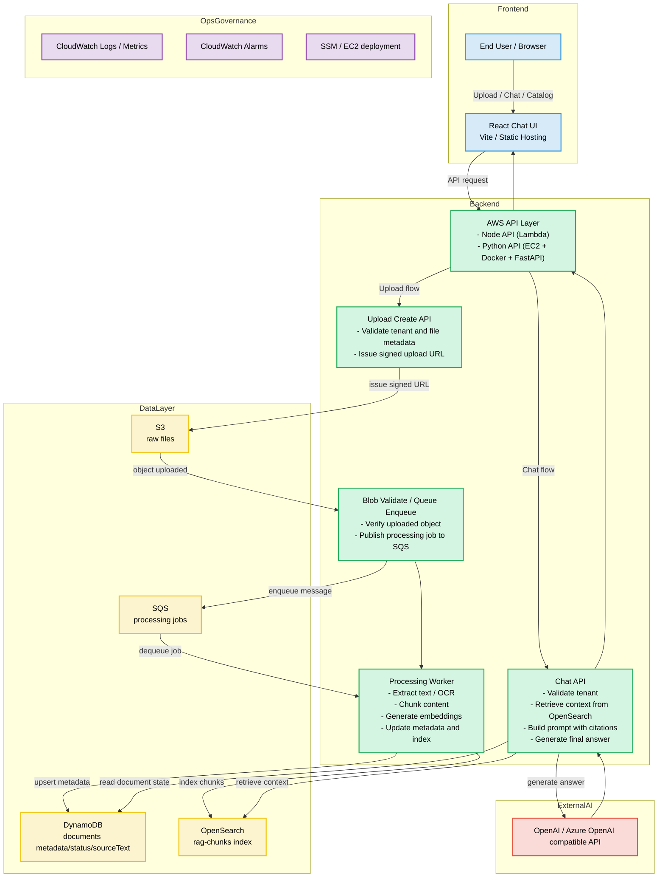

# AWS Chatbot Feature Architecture

[← README로 돌아가기](../README.md)

이 문서는 현재 앱의 AWS 기준 RAG 챗봇 기능 구조를 정리한 아키텍처다. 프론트엔드는 동일한 React SPA를 사용하고, 백엔드 프로필에 따라 AWS Node 또는 AWS Python 구성을 선택할 수 있다. 현재 운영 흐름은 S3, DynamoDB, OpenSearch, SQS, 그리고 Python EC2/Docker 백엔드를 중심으로 동작한다.

## 컴포넌트 매핑

- Frontend
  - React 기반 업로드, 챗, 카탈로그 단일 UI
  - 백엔드 프로필에 따라 AWS Node, AWS Python, Azure 등을 전환할 수 있음
- Backend
  - `uploads/create`, `chat`, `flags/deployment`, `documents/catalog`, `documents/:id/source`, `documents/:id/purge`, `documents/:id/status`
  - AWS Python 백엔드는 EC2 + Docker + FastAPI로 동작
  - 업로드 후처리와 검색 인덱싱은 SQS 기반 비동기 파이프라인으로 분리
- Data
  - S3: 원본 파일 저장
  - DynamoDB: 문서 메타데이터, 상태, `sourceText`
  - OpenSearch: 청크/벡터 검색 인덱스
  - SQS: 처리 작업 큐
- External AI
  - OpenAI 계열 모델 호출로 최종 답변 생성
  - 임베딩도 동일한 계열 API 또는 호환 API를 사용 가능
- Ops
  - CloudWatch 로그/메트릭/알람
  - SSM 기반 배포 및 EC2 운영

## 시나리오별 흐름

### 1) 업로드와 인덱싱

1. UI가 `uploads/create` API를 호출한다.
2. 백엔드는 tenant와 파일 메타데이터를 검증하고 signed URL을 발급한다.
3. 브라우저가 signed URL로 S3에 직접 업로드한다.
4. 업로드 완료 후 검증 단계가 SQS 작업을 발행한다.
5. 워커가 S3에서 파일을 내려받아 텍스트 추출과 OCR을 수행한다.
6. 텍스트를 청크로 나누고 필요 시 임베딩을 생성한다.
7. DynamoDB에는 문서 상태와 `sourceText`가 저장되고, OpenSearch에는 청크가 적재된다.
8. UI의 카탈로그는 DynamoDB와 OpenSearch 정보를 병합해 보여준다.

### 2) 챗 질의

1. UI가 `chat` API를 호출한다.
2. 백엔드는 tenant 검증을 수행하고 OpenSearch에서 관련 청크를 조회한다.
3. 필요 시 DynamoDB의 `sourceText` 또는 문서 상태를 함께 참조한다.
4. 상위 청크를 프롬프트로 조립하고 모델을 호출한다.
5. 답변, citation, retrieved chunk 수를 UI로 반환한다.

### 3) 카탈로그/소스 조회

1. UI는 `documents/catalog`를 호출한다.
2. 백엔드는 DynamoDB의 문서 메타데이터와 OpenSearch의 chunk 집계를 합쳐 반환한다.
3. 사용자는 각 문서의 상태, 청크 수, source text를 확인할 수 있다.

### 4) 운영/배포

1. SSM 또는 배포 스크립트가 EC2 컨테이너를 갱신한다.
2. CloudWatch 로그와 헬스 체크로 인덱싱과 챗 동작을 확인한다.
3. OpenSearch 집계가 비는 경우에도 DynamoDB의 `chunkCount`와 개별 count 조회로 카탈로그가 비지 않게 보정한다.

## 왜 이 구조인가

- S3 direct upload를 쓰면 백엔드가 대용량 파일을 중계하지 않아도 된다.
- SQS로 업로드와 무거운 처리를 분리하면 OCR과 임베딩이 느려져도 API 응답성이 유지된다.
- DynamoDB는 운영 메타데이터와 상태를 저장하기에 적합하고, OpenSearch는 검색 전용 저장소로 분리하기 좋다.
- EC2 + Docker 기반 Python 백엔드는 OpenAI 호출, OCR, 문서 처리 파이프라인을 한곳에서 통제하기 쉽다.

## 구현 메모

- AWS Python 백엔드에서는 `sourceText`를 DynamoDB에 저장해, OpenSearch가 일시적으로 비어도 챗/카탈로그가 완전히 깨지지 않도록 한다.
- 카탈로그는 `chunkCount`를 DynamoDB 기준으로도 보여주고, OpenSearch 결과가 있으면 이를 우선 사용한다.
- 검색이 꺼진 경우에도 업로드와 메타데이터 조회는 유지되도록 설계한다.
