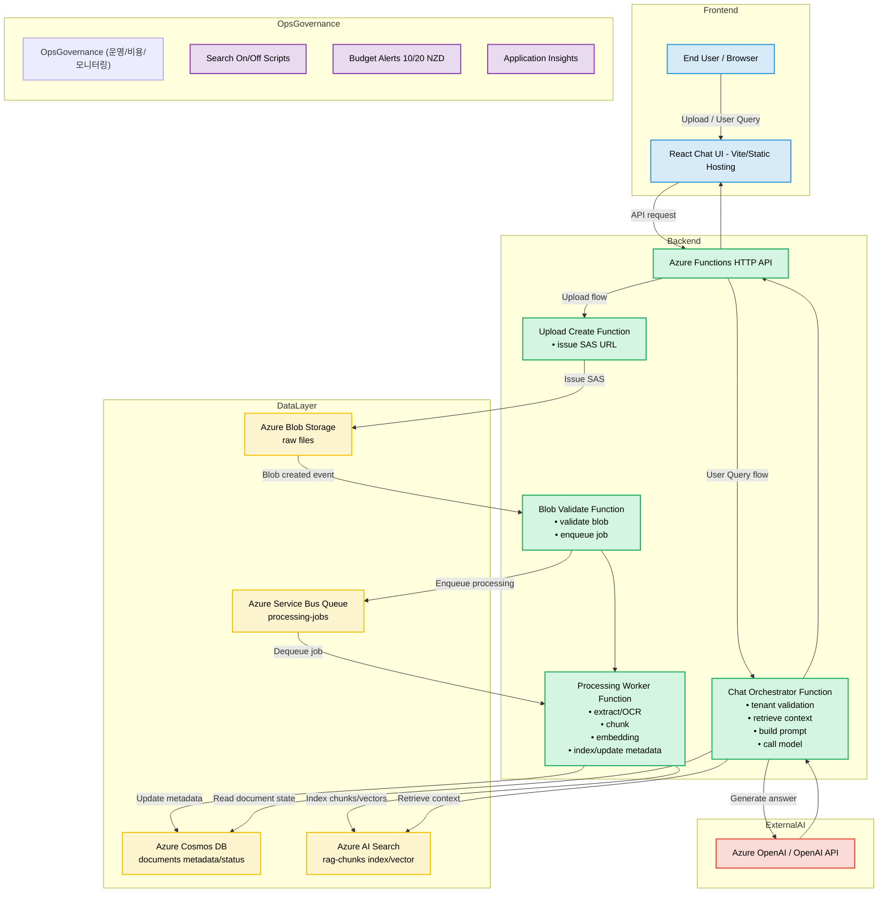

# Azure Chatbot Feature Architecture

[← README로 돌아가기](../README.md)

AWS 챗봇 구조와 유사한 수준으로, 현재 앱의 Azure 구성요소를 기준으로 정리한 아키텍처 다이어그램이다.

## 컴포넌트 매핑

- Frontend
  - React 기반 업로드/챗/카탈로그 단일 UI
- Backend
  - HTTP API: uploads/create, chat, flags/deployment, documents/catalog, purge, status
  - Blob Trigger + Queue Trigger: 비동기 인제스트 파이프라인
- Data
  - Blob: 원본 파일
  - Service Bus: 처리 큐
  - Cosmos: 문서 상태/메타데이터
  - AI Search: 청크/벡터 검색
- External AI
  - OpenAI 계열 모델 호출 (생성 답변/임베딩)
- Ops
  - App Insights 모니터링
  - Azure Budget Alert
  - Search 온디맨드 운영 스크립트

## 시나리오별 흐름

### 1) 업로드와 인덱싱

1. UI가 `uploads/create`로 SAS를 요청한다.
2. 브라우저가 Blob에 직접 업로드한다.
3. Blob Trigger가 큐에 작업을 넣는다.
4. Queue Worker가 추출/OCR/청킹/임베딩/인덱싱을 수행한다.
5. Cosmos와 Search가 갱신되고, UI는 상태/카탈로그를 갱신한다.

### 2) 챗 질의

1. UI가 `chat` API를 호출한다.
2. 오케스트레이터가 tenant 필터로 Search(필요 시 Cosmos)를 조회한다.
3. 컨텍스트를 프롬프트로 조립하고 모델을 호출한다.
4. 답변과 citation을 UI로 반환한다.

### 3) 운영/비용 제어

1. Search가 필요할 때 `scripts/search-on.sh` 실행
2. 사용하지 않을 때 `scripts/search-off.sh` 실행
3. 월 예산 임계치(10/20 NZD) 알림으로 비용 초과를 조기 감지
