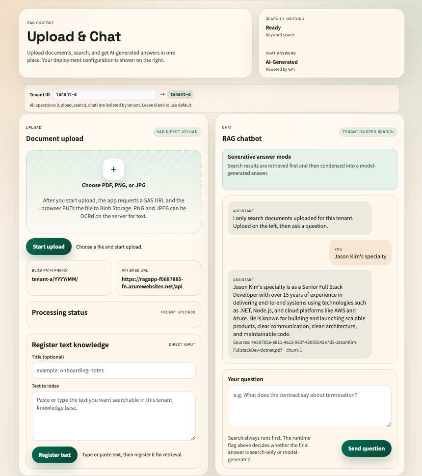

Kia ora,

I’m Jason Kim, a Senior Engineer with 15+ years of experience, based in Auckland. I enjoy working on problems that aren’t fully defined yet — turning rough ideas into working systems.

Recently at EmergencyQ, I worked as a sole senior engineer to deliver an Australia service expansion end-to-end — from architecture and cloud setup to backend and frontend delivery.

Previously at Visa, I worked on microservices that integrate with global banking systems, focusing on building reliable, high-availability services and distributed integrations at scale.

Across my recent work, I’ve focused on:  
\* Taking ownership of ambiguous problems and driving them through to production  
\* Designing pragmatic architectures across .NET, Node.js, and React  
\* Building and operating systems in AWS/Azure with CI/CD and serverless patterns  
\* Working across the stack rather than being limited to a single layer

One example that aligns strongly with this role is my work at Ambit AI:  
\* Led development of an AI-powered conversational system using a retrieval-based approach (early RAG pattern)  
\* Designed how relevant knowledge is retrieved and incorporated into prompts for grounded responses  
\* Delivered the solution into production as a core customer-facing capability

I’m not tied to specific tools — I focus on choosing the right approach for the problem, and I’m comfortable moving from design discussions to hands-on implementation quickly.

This role stood out to me because of its focus on building real AI-enabled systems and delivering practical outcomes — which aligns closely with how I like to work.

Ngā mihi,
Jason Kim

\====================

The following project showcases my experience across frontend, backend, CI/CD and applied AI development:

### **RAG (Retrieval-Augmented Generation) Chatbot System**

**User Manual / Portfolio**  
 [https://github.com/kimgyver/RAG-azure/blob/main/docs/user-manual-portfolio.md](https://github.com/kimgyver/RAG-azure/blob/main/docs/user-manual-portfolio.md)

---

