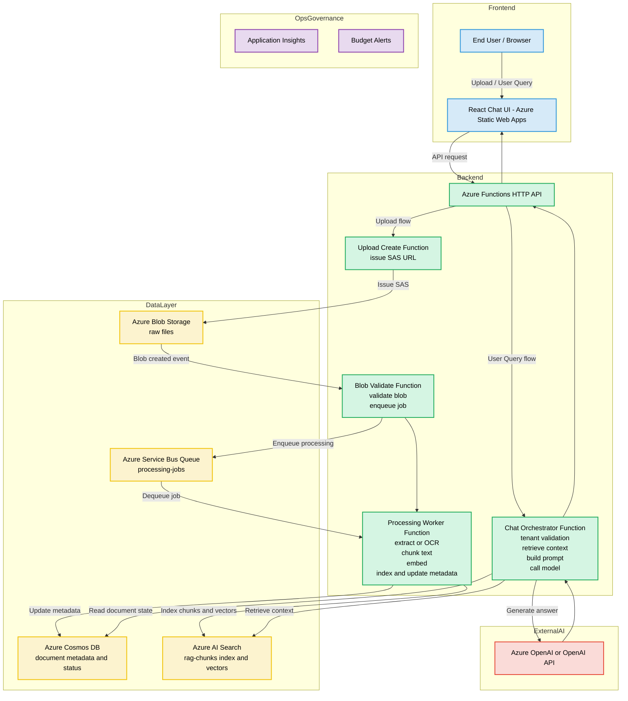

# 사용자 매뉴얼 - Azure RAG 문서 챗봇

## 1) 시스템 개요

이 프로젝트는 Azure 네이티브 기반의 RAG(Retrieval-Augmented Generation) 문서 챗봇 시스템입니다.

사용자는 다음을 수행할 수 있습니다.

- 웹 UI에서 PDF, PNG, JPG 파일 업로드
- 일반 텍스트를 검색 가능한 지식으로 직접 등록
- 테넌트 범위 기반 챗봇 질의
- 문서 처리 상태 및 카탈로그 확인
- Search 인덱스 데이터 및 Cosmos 메타데이터 삭제(Purge)

라이브 웹사이트:

- https://thankful-desert-09db9540f.7.azurestaticapps.net/

핵심 Azure 구성요소:

- Azure Static Web Apps: React 프론트엔드 호스팅
- Azure Functions: HTTP API 및 이벤트 기반 처리
- Azure Blob Storage: 원본 업로드 파일 저장
- Azure Service Bus Queue: 업로드와 무거운 처리 단계 분리
- Azure AI Search: 청크/벡터 저장 및 검색
- Azure Cosmos DB (선택): 문서 메타데이터/상태 저장
- Azure OpenAI 또는 OpenAI (선택): 최종 자연어 답변 생성

배포 및 운영 구성요소:

- Terraform (infra/): 인프라 프로비저닝 및 앱 설정 관리를 위한 IaC
- GitHub Actions: 인프라, Functions 백엔드, Static Web Apps 프론트엔드 자동 배포

알아두면 좋은 동작:

- 생성형 모델 없이도 Search 기반 동작이 가능합니다.
- OpenAI 자격증명이 없으면 Search-only fallback mode로 동작합니다.
- 업로드, 인덱싱, 챗 검색, 카탈로그, 퍼지는 모두 테넌트 범위로 동작합니다.

---

## 2) 전체 플로우 (Azure Chatbot Feature Architecture 다이어그램 포함)

### 2.1 아키텍처 다이어그램

### 2.2 실사용 기준 플로우 요약

1. 사용자가 테넌트를 선택하고 파일을 업로드합니다.
2. 프론트엔드가 Azure Functions에 SAS 업로드 URL을 요청합니다.
3. 브라우저가 SAS를 사용해 Blob Storage로 직접 업로드합니다.
4. Blob trigger가 파일을 검증하고 Service Bus에 작업을 넣습니다.
5. Queue worker가 텍스트 추출(OCR 포함), 청킹, 임베딩(선택)을 수행하고 다음에 저장합니다.

- Search 인덱스 데이터는 Azure AI Search로 저장
- 메타데이터/상태는 필요 시 Cosmos DB에 저장

6. 사용자가 챗 패널에서 질문합니다.
7. Chat API가 테넌트 필터 기반으로 Search에서 관련 청크를 조회합니다.
8. 모델 자격증명이 있으면 Azure OpenAI/OpenAI로 최종 답변을 생성하고, 없으면 검색 기반 합성 답변을 반환합니다.
9. UI에 답변과 citation이 표시됩니다.

---

## 3) 사용자 사용 가이드 (상세 단계)

이 섹션은 코드 지식이 없는 사용자도 화면만 보고 따라 할 수 있도록 작성했습니다.

### 3.1 애플리케이션 접속

1. 브라우저에서 아래 주소를 엽니다.

- https://thankful-desert-09db9540f.7.azurestaticapps.net/

2. 대시보드가 로딩될 때까지 기다립니다.
3. 다음 주요 패널이 보이는지 확인합니다.

- Tenant context bar
- Document upload
- RAG chatbot
- Cosmos/Search catalog

### 3.2 먼저 테넌트 컨텍스트 설정

1. Tenant ID 입력란에 값을 입력합니다. 예: tenant-a
2. 화살표 오른쪽의 effective tenant 값이 의도한 값인지 확인합니다.
3. 다음 점을 기억합니다.

- 업로드 경로, 인덱싱, 챗 검색, 카탈로그, 퍼지가 모두 같은 테넌트를 사용합니다.
- 테넌트를 바꾸면 조회 가능한 데이터와 답변 범위가 바뀝니다.

팁:

- 서버 측 allowlist 정책이 있는 경우 허용되지 않은 tenant는 에러를 반환합니다.

### 3.3 문서 업로드 (PDF/PNG/JPG)

1. Document upload 패널에서 파일 선택 버튼을 클릭합니다.
2. PDF, PNG, JPG 파일을 선택합니다.
3. Start upload 버튼을 클릭합니다.
4. 상태 메시지를 확인합니다.

- Uploading
- Processing document
- Text extraction and chunking complete
- Indexing complete

5. Processing status(Recent uploads) 영역의 상태 pill이 갱신되는지 확인합니다.

백엔드에서 일어나는 일:

- 앱이 /api/uploads/create로 SAS를 요청합니다.
- 브라우저가 Blob Storage로 직접 업로드합니다.
- 이벤트 기반 파이프라인이 처리/인덱싱을 수행합니다.

### 3.4 텍스트 직접 등록 (파일 없이)

빠른 데모 데이터를 만들 때 유용합니다.

1. Register text knowledge 영역에서 다음을 입력합니다.

- Title(선택)
- Text to index

2. Register text 버튼을 클릭합니다.
3. 완료 메시지를 기다립니다.
4. 카탈로그 반영 및 챗 검색 가능 여부를 확인합니다.

데모 권장 입력량:

- 3~10개 단락 정도의 짧은 텍스트부터 시작하면 인덱싱 검증이 쉽습니다.

### 3.5 카탈로그에서 인덱싱 결과 검증

1. Cosmos · Search document catalog 패널로 이동합니다.
2. Refresh list 버튼을 클릭합니다.
3. 각 행에서 다음을 확인합니다.

- documentId
- file name
- Cosmos status/chunk count (Cosmos 활성 시)
- Search chunk count

4. 사용 가능하면 View source로 원문 텍스트를 확인합니다.

모드 해석:

- Cosmos ON: 업로드 상태/메타데이터가 Cosmos에 저장됩니다.
- Cosmos OFF: Search 기반 행만으로도 카탈로그 동작이 가능합니다.

### 3.6 RAG 챗봇 질의

1. RAG chatbot 패널로 이동합니다.
2. Your question 입력창에 질문을 작성합니다.
3. Send question 버튼을 누르거나 Shift 없이 Enter를 누릅니다.
4. 다음을 확인합니다.

- Assistant answer
- Sources(citation)

질문 예시:

- 계약서 해지 조건은 어떻게 명시되어 있나요?
- 업로드된 노트의 온보딩 요구사항을 요약해 주세요.
- 핵심 리스크 조항과 근거 출처를 알려주세요.

### 3.7 런타임 답변 모드 이해

UI에는 다음 두 상태 중 하나가 표시됩니다.

1. Generative answer mode

- Search로 관련 청크를 먼저 찾고
- 모델이 최종 답변을 생성합니다.

2. Search-only fallback mode

- 오류 상태가 아닙니다.
- OpenAI 자격증명이 없어서 검색 결과 기반으로 답변을 구성합니다.

포트폴리오 데모 포인트:

- Search-only 모드: 인제스트/검색 품질 검증에 유리
- Generative 모드: 완전한 RAG 답변 합성 능력 시연

### 3.8 인덱스 데이터 안전 삭제 (Purge)

1. 카탈로그에서 대상 문서 행의 Purge index data 버튼을 클릭합니다.
2. 완료 후 Refresh list를 클릭합니다.

중요:

- Purge는 AI Search 청크와 Cosmos 메타데이터를 제거합니다.
- Blob Storage의 원본 파일은 삭제하지 않습니다.

### 3.9 인터뷰 시연 스크립트 (5~10분)

1. Tenant ID 설정
2. PDF 1개 + 이미지 1개 업로드
3. 짧은 텍스트 1건 직접 등록
4. 카탈로그 새로고침 후 chunk count 확인
5. 질문 2~3개 수행 후 citation 확인
6. Search-only/Generative 모드 차이 설명
7. 문서 1건 purge 후 카탈로그 변화 확인

### 3.10 자주 발생하는 이슈

1. 카탈로그가 로드되지 않음

- 백엔드에서 Search 또는 Cosmos 활성화 여부 확인
- tenant 값 및 허용 여부 확인

2. 챗 답변이 약하거나 일반적임

- 인덱싱 완료 여부 먼저 확인
- 문서 기반의 구체적 질문 사용
- citation 존재 여부 확인

3. Search-only fallback mode가 보임

- OpenAI 자격증명이 설정되지 않은 상태를 의미
- 검색 기능은 정상이며 생성형 답변만 제한됨

4. 업로드 완료 후 상태 반영이 늦음

- 큐 기반 백그라운드 처리가 진행 중일 수 있음
- 잠시 후 카탈로그를 새로고침

---

## 4) Terraform 및 자동 배포 (CI/CD)

이 프로젝트는 애플리케이션 기능 데모뿐 아니라, IaC와 자동화 워크플로를 통한 운영형 전달 체계도 함께 보여줍니다.

### 4.1 이 저장소에서 Terraform이 담당하는 범위

- 위치: infra/
- 목적: 핵심 Azure 리소스 생성 및 런타임 설정 관리
- 대표 관리 리소스:
  - Resource Group
  - Function App 및 호스팅 설정
  - Storage account 및 컨테이너
  - Service Bus namespace 및 queue
  - Application Insights

채용자 관점에서 Terraform 포인트:

- 환경 재현성 확보
- 인프라 변경 이력 추적 가능
- 수동 설정 실수 위험 감소

### 4.2 자동 배포 워크플로

1. Infra + Functions Deploy 워크플로

- 파일: .github/workflows/infra-functions-deploy.yml
- 트리거:
  - main 브랜치 push 중 infra/**, backend/functions-ingestion/** 변경
  - 수동 workflow_dispatch
- 주요 역할:
  - Azure 로그인 및 환경 값 해석
  - Terraform init/apply 수행
  - Functions 빌드/배포(옵션)
  - Search/Cosmos/OpenAI 설정값이 있으면 앱 설정 병합

2. Azure Static Web Apps CI/CD 워크플로

- 파일: .github/workflows/azure-static-web-apps.yml
- 트리거:
  - main 브랜치 push 중 frontend/\*\* 변경
  - 수동 workflow_dispatch
- 주요 역할:
  - 프론트엔드 빌드
  - API base URL 및 SWA 배포 토큰 해석
  - Azure Static Web Apps로 프론트 배포
