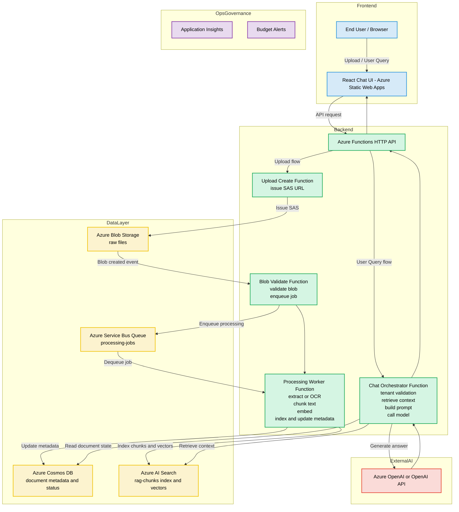

# User Manual - Azure RAG Document Chatbot

## 1) System Overview

This project is an Azure-native RAG (Retrieval-Augmented Generation) document chatbot system.

Users can:

- Upload PDF, PNG, and JPG files through a web UI.
- Register plain text directly as searchable knowledge.
- Ask tenant-scoped questions in a chatbot.
- View document status and catalog data.
- Purge indexed document data from Search and Cosmos metadata.

Live website:

- https://thankful-desert-09db9540f.7.azurestaticapps.net/

Core Azure components:

- Azure Static Web Apps: Hosts the React frontend.
- Azure Functions: HTTP APIs and event-driven processing.
- Azure Blob Storage: Stores raw uploaded files.
- Azure Service Bus Queue: Decouples upload from heavy processing.
- Azure AI Search: Stores chunked text and vectors for retrieval.
- Azure Cosmos DB (optional): Stores document metadata and processing state.
- Azure OpenAI / OpenAI (optional): Generates final natural-language answers.

Delivery and operations components:

- Terraform (infra/): Infrastructure as Code for resource provisioning and app settings.
- GitHub Actions: Automated CI/CD for infrastructure, Functions backend, and Static Web Apps frontend.

Key behavior to understand:

- Search can run without generative AI.
- If OpenAI credentials are not configured, the app runs in Search-only fallback mode.
- All operations are tenant-scoped (upload, indexing, chat retrieval, catalog, purge).

---

## 2) End-to-End Flow (with Azure Chatbot Feature Architecture Diagram)

### 2.1 Architecture Diagram

### 2.2 Practical Flow Summary

1. A user chooses a tenant and uploads a file.
2. The frontend requests a SAS upload URL from Azure Functions.
3. The browser uploads directly to Blob Storage using SAS.
4. Blob trigger validates the file and pushes a job to Service Bus.
5. Queue worker extracts text (and OCR for images), chunks it, optionally embeds it, and writes:

- Search index data to Azure AI Search.
- Optional metadata/state to Cosmos DB.

6. The user asks a question in chat.
7. The chat API retrieves tenant-filtered chunks from Search.
8. If model credentials exist, it generates a final answer via Azure OpenAI/OpenAI; otherwise it returns search-only synthesis.
9. The UI displays answer plus citations.

---

## 3) User Guide (Step-by-Step)

This section is written so a reviewer can follow and operate the app without source-code knowledge.

### 3.1 Open the application

1. Open this URL in a browser:

- https://thankful-desert-09db9540f.7.azurestaticapps.net/

2. Wait for the dashboard to load.
3. Confirm main panels are visible:

- Tenant context bar
- Document upload
- RAG chatbot
- Cosmos/Search catalog

### 3.2 Set tenant context first

1. In Tenant ID, enter your tenant value (example: tenant-a).
2. Verify the effective tenant value shown next to the arrow.
3. Keep this in mind:

- The same tenant is applied to upload path, indexing, chat retrieval, catalog, and purge.
- Changing tenant changes what data you can see and ask about.

Tip:

- If tenant policy is restricted server-side, a tenant not on the allowlist returns an error.

### 3.3 Upload a document (PDF/PNG/JPG)

1. In Document upload, click the file picker.
2. Select a PDF, PNG, or JPG file.
3. Click Start upload.
4. Observe status messages:

- Uploading
- Processing document
- Text extraction and chunking complete
- Indexing complete

5. Check Processing status (Recent uploads) for status pill updates.

What happens in the backend:

- The app requests SAS from /api/uploads/create.
- Your browser uploads directly to Blob Storage.
- Event-driven pipeline processes and indexes the file.

### 3.4 Register text directly (without file upload)

Use this when you want quick demonstration data.

1. In Register text knowledge:

- Optionally enter Title.
- Paste content into Text to index.

2. Click Register text.
3. Wait for completion message.
4. Verify the new entry appears in the catalog and can be retrieved in chat.

Recommended demo text size:

- Start with 3 to 10 short paragraphs for fast indexing and easy retrieval validation.

### 3.5 Verify indexed documents in catalog

1. Open Cosmos · Search document catalog panel.
2. Click Refresh list.
3. Review each row:

- documentId
- file name
- Cosmos status and chunk count (if Cosmos is enabled)
- Search chunk count

4. Use View source when available (Cosmos source text exists).

How to interpret modes:

- Cosmos ON: metadata and document state are persisted in Cosmos.
- Cosmos OFF: catalog may still work from Search-only rows.

### 3.6 Ask questions in RAG chatbot

1. Go to RAG chatbot panel.
2. Enter a question in Your question.
3. Click Send question (or Enter without Shift).
4. Read:

- Assistant answer
- Sources section (citations)

Ask high-signal questions, such as:

- What does the document say about termination conditions?
- Summarize the onboarding requirements from uploaded notes.
- List key risk clauses and their source references.

### 3.7 Understand runtime answer mode

The UI displays one of these states:

1. Generative answer mode

- Search retrieves chunks first.
- The model synthesizes a natural answer.

2. Search-only fallback mode

- Not an error.
- Returned answer is assembled from retrieval results because no OpenAI credential is configured.

For portfolio demos:

- Search-only mode is still useful to prove ingestion quality and retrieval correctness.
- Generative mode demonstrates full RAG answer synthesis quality.

### 3.8 Purge indexed data safely

1. In the catalog row for a document, click Purge index data.
2. Confirm completion.
3. Click Refresh list.

Important:

- Purge removes AI Search chunks and Cosmos metadata only.
- Blob file objects in storage are not deleted by this action.

### 3.9 Suggested demo script for interviews

Use the following sequence for a 5 to 10 minute walkthrough:

1. Set Tenant ID.
2. Upload one PDF and one image.
3. Register one short text note.
4. Refresh catalog and show chunk counts.
5. Ask 2 to 3 questions and point out citations.
6. Explain Search-only vs Generative mode from runtime callout.
7. Purge one document and show catalog update.

### 3.10 Common troubleshooting

1. Catalog does not load

- Check whether Search or Cosmos is enabled in backend runtime settings.
- Confirm tenant is allowed and spelled correctly.

2. Chat answers are weak or generic

- Ensure indexing completed first.
- Ask narrower, document-grounded questions.
- Verify retrieval citations are present.

3. You see Search-only fallback mode

- This indicates OpenAI credentials are not configured in runtime.
- Retrieval is still working; generation is intentionally limited.

4. Upload seems complete but status is delayed

- Background queue processing may still be running.
- Refresh catalog after a short wait.

---

## 4) Terraform and Automated Deployment (CI/CD)

This project is not only an application demo. It also demonstrates production-style delivery using Infrastructure as Code and workflow automation.

### 4.1 Terraform scope in this repository

- Location: infra/
- Purpose: Provision and manage core Azure resources and runtime settings.
- Typical managed resources:
  - Resource Group
  - Function App and related hosting settings
  - Storage account and containers
  - Service Bus namespace and queue
  - Application Insights

Terraform value for reviewers:

- Reproducible environment creation
- Traceable infrastructure changes
- Lower manual configuration risk

### 4.2 Automated deployment workflows

1. Infra + Functions Deploy workflow

- File: .github/workflows/infra-functions-deploy.yml
- Triggered on:
  - Push to main for infra/** and backend/functions-ingestion/** changes
  - Manual workflow_dispatch
- Main responsibilities:
  - Azure login and environment resolution
  - Terraform init/apply for infrastructure
  - Optional Functions build and publish
  - Runtime app-setting merge for Search/Cosmos/OpenAI when configured

2. Azure Static Web Apps CI/CD workflow

- File: .github/workflows/azure-static-web-apps.yml
- Triggered on:
  - Push to main for frontend/\*\* changes
  - Manual workflow_dispatch
- Main responsibilities:
  - Frontend build
  - Resolve API base URL and SWA deployment token
  - Deploy frontend to Azure Static Web Apps
